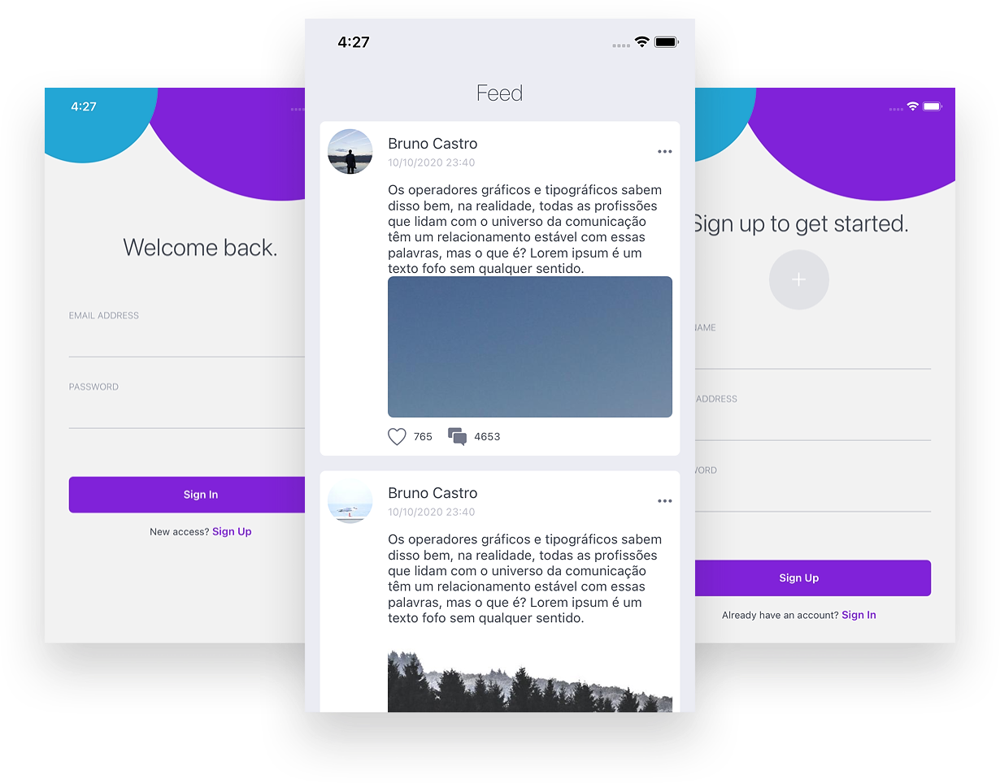

<h2 align="center">

<br/><br/>
Criando um APP Social
<br/><br/>

<p align="center">
  <a href="#sobre">Projeto</a>&nbsp;&nbsp;&nbsp;|&nbsp;&nbsp;&nbsp;
  <a href="#tecnologias">Tecnologias</a>&nbsp;&nbsp;&nbsp;|&nbsp;&nbsp;&nbsp;
  <a href="#setup">Setup</a>&nbsp;&nbsp;&nbsp;|&nbsp;&nbsp;&nbsp;
  <a href="#layout">Layout</a>&nbsp;&nbsp;&nbsp;|&nbsp;&nbsp;&nbsp;
  <a href="#licença">Licença</a>
</p>

## Projeto

Criando app social e integrando com firebase.

## Tecnologias

Esse projeto foi desenvolvido com as seguintes tecnologias:

- [Expo](https://expo.io)
- [Firebase](https://firebase.google.com)
- [Styled Components](https://styled-components.com)
- [Lottie](https://lottiefiles.com)

## Setup

Clone o repositório em sua máquina:

`git clone https://github.com/BrunoLagoa/appSocial`

```bash
# Entre no repositório
# Instale as dependências
$ yarn

# Inicie o server
$ expo start

```

## Layout

<div align="center">
    
</div>

<br/><br/>

---

## Licença

Esse projeto está sob a licença MIT. Veja o arquivo [LICENSE](LICENSE.md) para mais detalhes.

---

<h3 align="center">
Autor: <a alt="Bruno Castro" href="https://brunocastro.dev">Bruno Castro</a>
</h3>

<p align="center">

  <a alt="Bruno Castro Linkedin" href="https://www.linkedin.com/in/brunovcastro">
    </a>
  <a alt="Bruno Castro GitHub" href="https://github.com/brunolagoa">
  </a>

</p>
